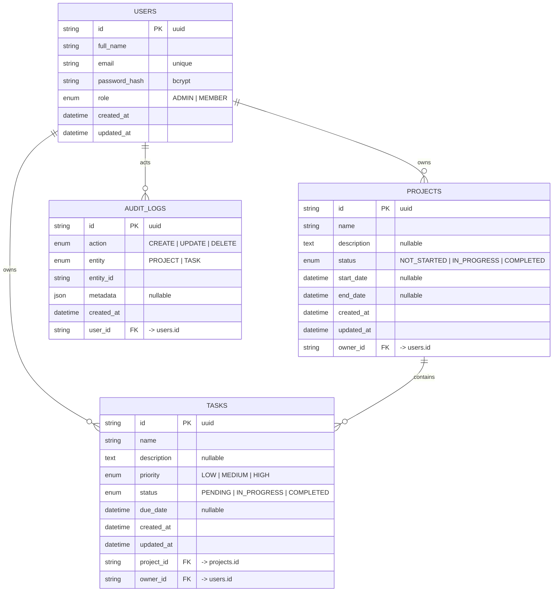

# Database Schema / ER Diagram

The database is MySQL, modelled with Prisma. Three tables with foreign-key
relationships and `ON DELETE CASCADE` so deleting a user removes their projects
and tasks, and deleting a project removes its tasks.

## Relationships

| From            | To             | Type         | On delete |
| --------------- | -------------- | ------------ | --------- |
| `users.id`      | `projects.owner_id`   | one-to-many | CASCADE |
| `users.id`      | `tasks.owner_id`      | one-to-many | CASCADE |
| `users.id`      | `audit_logs.user_id`  | one-to-many | CASCADE |
| `projects.id`   | `tasks.project_id`    | one-to-many | CASCADE |

## Design notes

- **UUID primary keys** avoid exposing sequential, guessable identifiers.
- **`owner_id` on `tasks`** is denormalised (a task's owner always equals its
  project's owner) so authorization checks and dashboard aggregates run without
  an extra join. Ownership of the project is still validated whenever a task is
  created.
- **Indexes** exist on every foreign key plus the `status`/`priority` columns
  used for filtering.
- **Enums** are enforced at the database level and validated again in the API
  layer via `class-validator`.
- **`users.role`** drives role-based access control (RBAC). Members access only
  their own data; admins additionally reach `/admin/*` routes and all audit logs.
- **`audit_logs`** is an append-only trail of create/update/delete actions on
  projects and tasks, with an optional `metadata` JSON column for context.

The authoritative source of truth is [`backend/prisma/schema.prisma`](../backend/prisma/schema.prisma).
The generated SQL lives in [`backend/prisma/migrations/`](../backend/prisma/migrations/).
